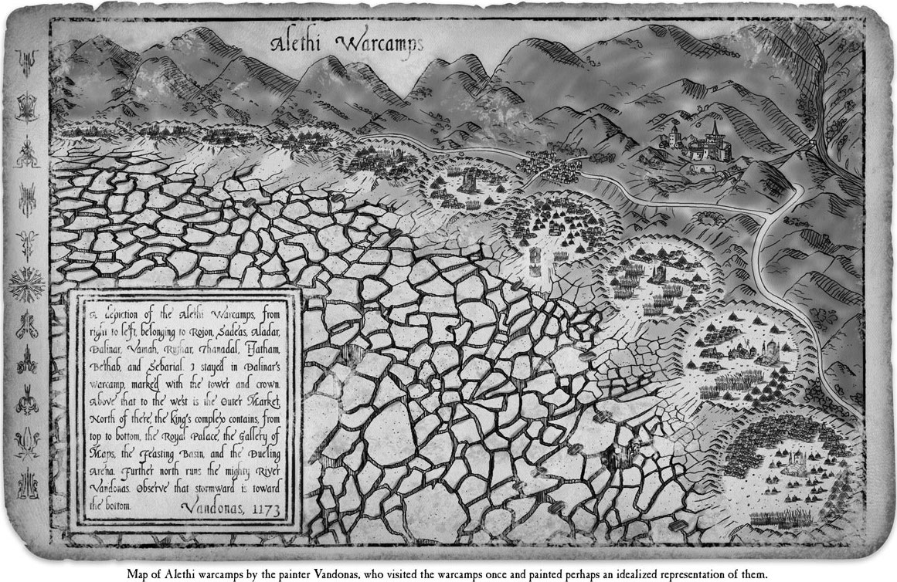
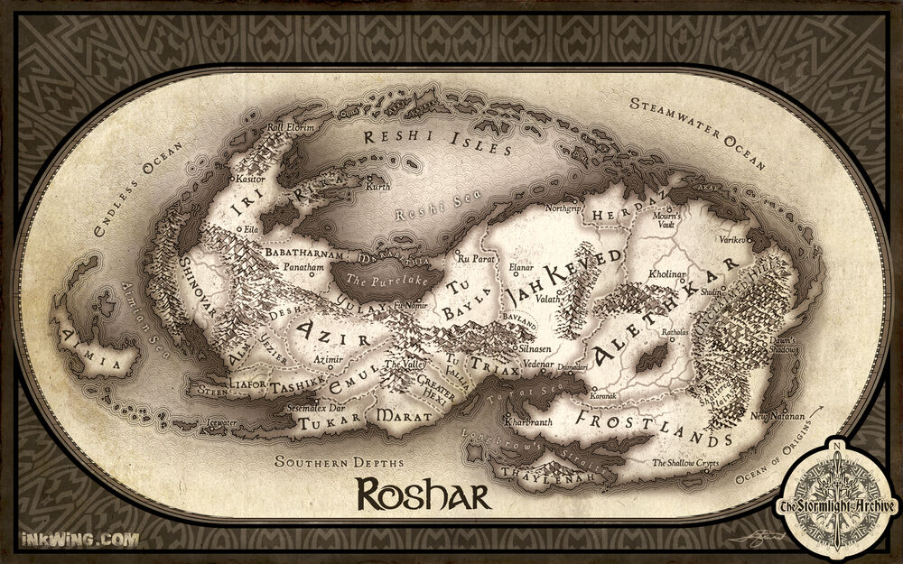

<!DOCTYPE html>
<html>
  <head>
    <meta charset="UTF-8">
    <title>Home</title>
    <link rel="stylesheet" href="home.css" type="text/css">
    <!--
      Decided to incorporate bootstrap into every page MAINLY for the way it incorporated
      a specific font for the title (what news, and subpage titles), the line divider look,
      and other stylistic aspects. I did not use it to ease up content addition (I made sure to
      use html/css/javascript explicitly for almost all of that), EXCEPT for carousel on home
      page. That was from bootstrap.
    -->
    <link rel="stylesheet" href="https://maxcdn.bootstrapcdn.com/bootstrap/3.4.1/css/bootstrap.min.css">
    
    
  </head>
  <body>
    <!--
      Referenced How To W3 school to figure out how to set up navigation background
        https://www.w3schools.com/howto/howto_js_topnav.asp
        The navigation is a unordered list, which has a link to each of my html pages.
        The nav tag helps mainly so that in the css file, I can reference the unordered list
        specifially for navigation, in the case that I have many uls.
      Found 
 to insert that thin line divide
        https://www.w3schools.com/howto/howto_css_portfolio_gallery.asp
    -->
    <h1 class="title">what news?</h1>
    

    <nav>
      <ul>
        <li><a href="index.html">Home</a></li>
        <li><a href="news.html">News</a></li>
        <li><a href="opinion.html">Opinion</a></li>
        <li><a href="quizzes.html">Quizzes</a></li>
      </ul>
    </nav>
    <!--
      Used Bootstrap carousel for the carousel requirement.
      Referenced and used code provided on Bootstrap W3 school
        https://www.w3schools.com/bootstrap/bootstrap_carousel.asp
      Referenced: https://getbootstrap.com/docs/4.0/components/carousel/
        Mainly to find another site that explained the way bootstrap carousel works.
    -->
    <!--
      Creates a div with a unique id for this carousel. This is important, especially
      if I decided to have more than one carousel.
      class 'carousel' specifies that this contains a carousel and slide brings
      in the sliding aspect that is provided. 'data-ride' allows for the animation
      of the Slide start when page loads.
      Note: I had to keep myCarousel as the id because I realized if I changed
      it, it disabled the manual transition..
     -->

     

       <!--
          Each img that will be in carousel will be wrapped in a div tag with class
          "item", indicating that these will be in the carousel and the the specified
          img within each item is what will be in that particular slide.
          To be able to add caption and links on each slide, I had to place it into
          another div with class carousel-caption to indicate, again, tp the browser that
          this would be a carousel caption in this slide.
        -->
       

         

           
           

             <h3>Persisting War Against Parshendi</h3>
             
<cite>Map of Alethi warcamps</cite> by Isaac Stewart in the Stormlight Archive by Brandon Sanderson.

             <a href="news.html"><b>- Read Full Article -</b></a>
           

         

         

           
           

             <h3>Where to Travel Next?</h3>
             
<cite>Map of Roshar</cite> by Isaac Stewart in the Stormlight Archive by Brandon Sanderson.

             <a href="opinion.html"><b>- Read Full Article -</b></a>
           

         

         

           
           

             <h3>What Orders of Knights Radiant would you Belong to?</h3>
             
<cite>Stormlight Archive Symbol</cite> in the Stormlight Archive by Brandon Sanderson.

             <a href="quizzes.html"><b>- Take the Quiz -</b></a>
           

         

       

       <!--
        The span with chevron-left and right add the arrows to move to Previous
        and next slide; the span with "sr-only" is added for those who have screen
        readers (for those who cannot view or click the arrows) will have it show
        up as Previous or Next.

        The a element allows for use, as users, to click on the arrow and be
        able to go to the next slide or prev slide. Without it, the transition still
        works, but we can't manually get to the next slide.
        The left and right class also places the arrows on either end respectively.
       -->
       <a class="left carousel-control" href="#myCarousel" data-slide="prev">
         
         Previous
       </a>
       <a class="right carousel-control" href="#myCarousel" data-slide="next">
         
         Next
       </a>
     

  </body>

</html>
